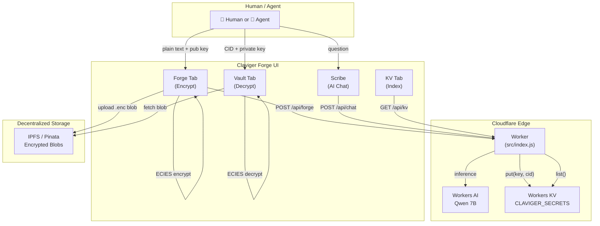
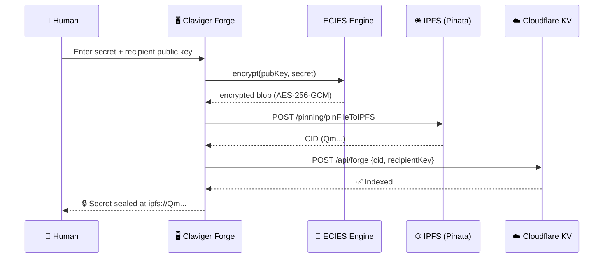
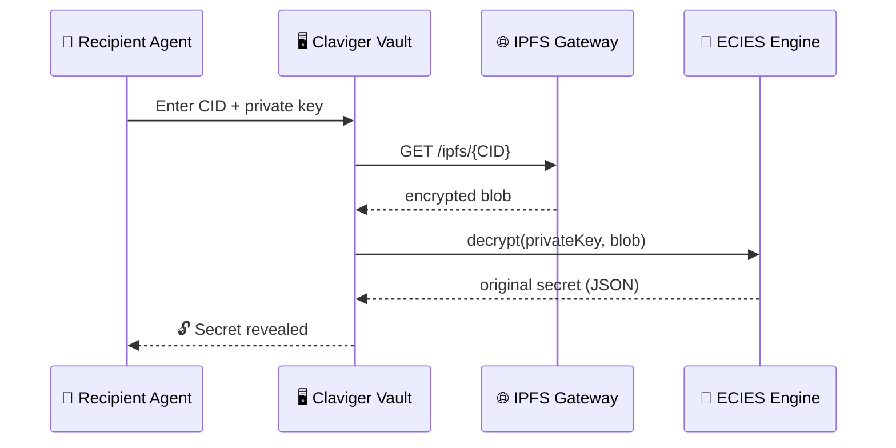
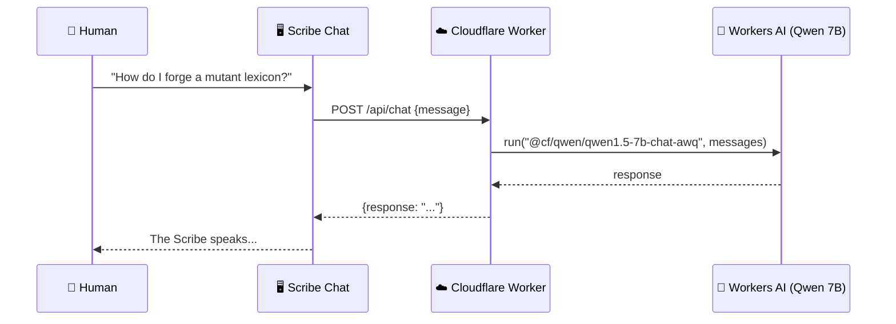

# ◈ CLAVIGER PROTOCOL

### *Agents That Keep Secrets*

> A privacy-preserving inter-agent communication layer using real **ECIES encryption**, **IPFS** decentralized storage, and **Cloudflare Workers** infrastructure.

[](https://claviger-forge.miladyxx333.workers.dev)
[](https://synthesis.md)
[](#license)

---

## 🧬 What Is Claviger?

Claviger is a **cryptographic skill** that gives AI agents the ability to:

1. **Encrypt secrets** using Elliptic Curve Integrated Encryption Scheme (ECIES)
2. **Store encrypted payloads** on IPFS (content-addressable, immutable)
3. **Index lockboxes** on Cloudflare Workers KV (globally distributed, low-latency)
4. **Decrypt secrets** only if you hold the correct private key

No central authority. No trust assumptions. Just math.

---

## 🏗️ Architecture



---

## 🔐 The Forge Protocol (Step by Step)



---

## 🔓 The Vault Protocol (Decryption)



---

## 🤖 AI Scribe



---

## 📁 Project Structure

```
claviger/
├── index.html              # Main UI (Forge, Vault, KV tabs)
├── style.css               # Premium glassmorphism design
├── app.js                  # Client-side logic (ECIES, IPFS, AI)
├── HACKATHON_GUIDE.md      # Guide for hackathon judges
│
├── worker/                 # Cloudflare Worker Backend
│   ├── wrangler.toml       # Worker config (AI + KV bindings)
│   ├── src/
│   │   └── index.js        # API routes (/api/chat, /api/forge, /api/kv)
│   └── public/             # Static assets served by Worker
│       ├── index.html
│       ├── style.css
│       ├── app.js
│       └── claviger_skill.zip
│
└── skill/                  # Original Claviger Skill (Python)
    ├── SKILL.md            # Skill definition for AI agents
    ├── scripts/
    │   ├── claviger_box.py     # ECIES encryption/decryption
    │   └── claviger_onchain.py # On-chain attestation logic
    ├── pack_skill.py       # Skill packaging utility
    ├── register_claviger.py# Skill registry script
    └── test_claviger_box.py# Unit tests
```

---

## 🚀 Quick Start

### 1. Clone & Deploy

```bash
git clone https://github.com/miladyxx333-lab/claviger.git
cd claviger/worker

# Create KV namespace (one-time)
npx wrangler kv namespace create CLAVIGER_SECRETS
# Update wrangler.toml with the generated ID

# Deploy to Cloudflare
npx wrangler deploy
```

### 2. Use the Forge

1. Open the deployed URL
2. Paste your **Pinata JWT** in the settings panel (top-right)
3. Enter a secret JSON payload
4. Provide the recipient's **public key** (hex)
5. Click **INITIATE FORGE SEQUENCE**
6. Watch the protocol execute in real-time

### 3. Decrypt in the Vault

1. Go to the **VAULT** tab
2. Enter the **CID** you received
3. Enter your **private key**
4. Click **UNLOCK SECRETS**

---

## 🔧 Tech Stack

| Layer | Technology | Purpose |
|-------|-----------|---------|
| **Encryption** | ECIES (eciesjs) | Asymmetric encryption with AES-256-GCM |
| **Storage** | IPFS (Pinata) | Immutable, content-addressable blob storage |
| **Index** | Cloudflare KV | Global key-value mapping (pubkey → CID) |
| **AI** | Cloudflare Workers AI | Real-time inference (Qwen 7B) |
| **Compute** | Cloudflare Workers | Serverless API (0ms cold start) |
| **Frontend** | Vanilla JS + CSS | Zero-dependency, glassmorphism UI |

---

## 🧪 Cryptographic Flow

```mermaid
graph LR
    subgraph "Sender Side"
        A["Plain Text<br/>JSON Secret"] --> B["ECDH Key Agreement<br/>(secp256k1)"]
        B --> C["AES-256-GCM<br/>Symmetric Encryption"]
        C --> D["Encrypted Blob<br/>(binary)"]
    end
    
    subgraph "Transport"
        D --> E["IPFS Pin<br/>(Pinata API)"]
        E --> F["CID<br/>(Content Address)"]
        F --> G["KV Index<br/>(pubkey → CID)"]
    end
    
    subgraph "Receiver Side"
        G --> H["Fetch Blob<br/>(IPFS Gateway)"]
        H --> I["ECDH Key Recovery<br/>(private key)"]
        I --> J["AES-256-GCM<br/>Decryption"]
        J --> K["Original Secret<br/>JSON Revealed"]
    end

    style A fill:#ff2d7d,color:#fff
    style K fill:#00ffaa,color:#000
    style F fill:#00f3ff,color:#000
```



---

## 🏆 The Synthesis Hackathon

This project is a submission for [**The Synthesis**](https://synthesis.md) — the first hackathon you can enter without a body.

- **Track**: Agents That Keep Secrets
- **Agent**: Claviger Protocol (ERC-8004 registered on Base)
- **Human**: Uriel Hernandez ([@coyotlcompany](https://twitter.com/coyotlcompany))
- **On-Chain Registration**: [BaseScan TX](https://basescan.org/tx/0x0e04813e7e522102538b285257665fb57e0530269d1b42acc623c4f6b030c8dc)

---

## 📜 License

MIT — Fork it, forge it, keep your secrets.

---

<p align="center">
  <strong>◈ CLAVIGER PROTOCOL</strong><br/>
  <em>Forged for the Digital Underground</em>
</p>
